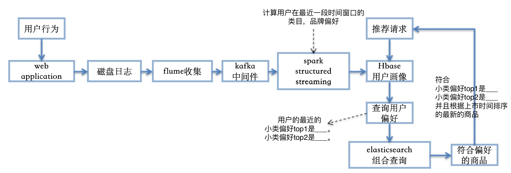

## 整体流程
**（一）用户行为收集：** 

flume + kafka + structured streaming + phoenix 将用户浏览，购买行为写入Hbase

**（二）实时商品热度统计：** 

flume + kafka + structured streaming + phoenix 计算商品的实时热度排名，写入Hbase做冷启动热门推荐和召回补足

**（三）实时用户偏好计算：** 

flume + kafka + structured streaming + phoenix 计算用户实时偏好写入Hbase用户画像，基于elasticsearch查询符合用户偏好的新品


#### 流程框架如下


## 日志格式
**json格式，记录用户名，行为类型，商品ID，小类ID，行为时间，查看kafka接受到的数据**
```
kafka-console-consumer -bootstrap-server localhost:9092 -topic mylog -from-beginning
```
```
{"user": "unk8", "behavior": "view", "item": "4535", "pty3": 23050303, "time": 1579587303210}
{"user": "unk2", "behavior": "buy", "item": "20300", "pty3": 25060119, "time": 1579587309211}
{"user": "unk7", "behavior": "view", "item": "34594", "pty3": 25070103, "time": 1579587315215}
{"user": "unk8", "behavior": "addCart", "item": "12324", "pty3": 22021101, "time": 1579587321219}
```

## 实时商品热度统计
**phoenix建立商品热度表**
```
0: jdbc:phoenix:> CREATE TABLE HOT_ITEM_STATIS (HOUR VARCHAR NOT NULL PRIMARY KEY, HOT VARCHAR) SPLIT ON ('1', '2', '3', '4', '5', '6', '7', '8', '9');
```
**提交spark流处理任务**

每隔1个小时统计商品热度排名，商品热度权重：浏览1分，加入购物车2分，购买3分，groupBy求和取排名前200
```
/usr/local/Cellar/apache-spark/2.4.4/libexec/bin/spark-submit \
--master local[*] \
--conf spark.executor.extraClassPath=/usr/local/Cellar/apache-spark/2.4.4/libexec/jars/* \
--conf spark.sql.shuffle.partitions=2 \
--class com.mycom.recsys.hot_item_statis \
/usr/local/Cellar/apache-spark/2.4.4/jobs/recsys-1.0-SNAPSHOT.jar
```
**查询phoenix结果**

查询每个小时段，最热门的商品ID序列
```
0: jdbc:phoenix:> select * from HOT_ITEM_STATIS;
```
```
+-------------+--------------------------------------------------------------------------------------------------------------------------------------------+
|    HOUR     |                                                                                                                                            |
+-------------+--------------------------------------------------------------------------------------------------------------------------------------------+
| 1112100202  | [28245,1767,46742,21100,18901,24556,19416,44708,3569,32059,44599,1920,3877,19625,28939,42323,10329,38896,48978,19095,21759,48279,24239,381 |
| 2112100202  | [44599,21100,19095,24187,8041,8926,27747,47760,27012,6601,6969,24256,34079,21434,44122,42323,31671,46058,5567,21355,49368,46364,35877,7345 |
| 3112100202  | [42244,6601,10384,40954,31133,767,1767,44599,43403,41759,42559,6554,48279,25935,47051,14029,828,40594,48978,21759,33343,1173,42333,9194,24 |
+-------------+--------------------------------------------------------------------------------------------------------------------------------------------+
```

## 实时用户偏好计算
**elasticsearch数据预览**
```
GET /recsys/goodsdata/WCJ7vW8BnuWS28ZqSZbG
```
```
{
  "_index" : "recsys",
  "_type" : "goodsdata",
  "_id" : "WCJ7vW8BnuWS28ZqSZbG",
  "_version" : 1,
  "_seq_no" : 18714,
  "_primary_term" : 1,
  "found" : true,
  "_source" : {
    "SERIES" : 18072500030278,
    "ITEM_NUM_ID" : 4005,
    "PTY_NUM_1" : 2406,
    "PTY_NUM_2" : 240601,
    "PTY_NUM_3" : 24060101,
    "PTY1_NAME" : "乳制品",
    "PTY2_NAME" : "奶酪",
    "PTY3_NAME" : "鲜奶酪",
    "BRAND_NAME" : "无品牌",
    "ITEM_NAME" : "兰诺斯水果坚果风味干酪",
    "SIM_ITEM_NAME" : "兰诺斯水果坚果风",
    "PRODUCT_ORIGIN_NUM_ID" : 69,
    "BRAND_ID" : 5335,
    "update_time" : "2019-12-29 00:00:00"
  }
}
```

**phoenix建立用户偏好表**
```
CREATE TABLE TOPIC_LIKE (USER VARCHAR NOT NULL PRIMARY KEY, PTY1 VARCHAR, PTY2 VARCHAR, PTY3 VARCHAR) SPLIT ON ('1', '2', '3', '4', '5', '6', '7', '8', '9');
```
**提交spark流处理任务**

每隔30分钟计算用户的类目偏好top3，计算公式：浏览次数*时间降权 groupBy求和取前3
```
/usr/local/Cellar/apache-spark/2.4.4/libexec/bin/spark-submit \
--master local[*] \
--conf spark.executor.extraClassPath=/usr/local/Cellar/apache-spark/2.4.4/libexec/jars/* \
--conf spark.sql.shuffle.partitions=2 \
--class com.mycom.recsys.user_topic_profile \
/usr/local/Cellar/apache-spark/2.4.4/jobs/recsys-1.0-SNAPSHOT.jar
```
**查询phoenix结果**
查询每30分钟时间窗口，用户的小类偏好top1，top2，top3
```
0: jdbc:phoenix:> select * from TOPIC_LIKE;
```
```
+--------+-----------+-----------+-------+
|  USER  |   PTY1    |   PTY2    | PTY3  |
+--------+-----------+-----------+-------+
| test0  | 23090402  | 25051101  | null  |
+--------+-----------+-----------+-------+
```

## 召回融合过滤去重补足
**融合逻辑：**

协同过滤CF召回 + Faiss最近浏览召回 + 实时偏好召回，结果去重

CF实现链接：https://github.com/xiaogp/recsys_spark

Faiss实现链接：https://github.com/xiaogp/recsys_faiss

**过滤逻辑**

过滤掉用户已经看过的商品

**补足逻辑**

如果召回补足一定的数量，采用当下热门商品做补足

```
python recall_source.py
```
```
Loading faiss.
------------------------用户偏好召回：数量24-------------------------
 [205853, 69585, 41365, 44418, 119242, 205854, 40877, 16001, 40878, 15948, 40876, 205855, 13979, 41922, 41920, 101970, 16080, 15989, 13981, 16079, 41921, 101971, 49730, 119243]
-----------------------itemcf召回：数量50------------------------
 [119176, 1936, 209913, 13050, 83075, 117920, 37608, 29357, 114814, 98199, 229598, 212127, 239072, 33648, 10380, 228481, 112771, 4338, 118123, 56766, 21907, 84001, 237192, 96696, 34930, 234477, 237555, 83556, 244044, 13979, 37579, 112458, 92708, 214242, 230685, 212249, 67899, 229586, 67795, 101971, 240757, 13488, 235280, 203569, 212247, 27933, 94957, 112930, 62916, 29990]
------------------------浏览相似召回：数量50-------------------------
 [98313, 67594, 98314, 67632, 67633, 51255, 51256, 51257, 94264, 110667, 2131, 2133, 86102, 2134, 2136, 2146, 2147, 2148, 34922, 34923, 34924, 34925, 34926, 34927, 34928, 34929, 34931, 34932, 79988, 34933, 34937, 34938, 34939, 59520, 34945, 34946, 34948, 34949, 34950, 47239, 34951, 34953, 34952, 73887, 75945, 75947, 28868, 28869, 28874, 28880]
-------------------------热门召回：数量50--------------------------
 [42244, 44599, 48279, 1767, 43403, 25935, 27747, 49512, 767, 6601, 34428, 20547, 16132, 8636, 41759, 40594, 33343, 42025, 40954, 31133, 47760, 1173, 42333, 9194, 10384, 24256, 49556, 45223, 28939, 48580, 35479, 1631, 15771, 39149, 42559, 6554, 12800, 6731, 828, 15351, 32939, 7345, 48258, 21759, 24239, 4385, 2472, 752, 27153, 5458]
-------------------------召回融合：数量200-------------------------
 [98313, 67594, 98314, 30227, 205853, 205854, 205855, 84001, 92708, 67633, 51255, 51256, 51257, 94264, 49730, 110667, 15948, 101970, 101971, 2131, 2133, 86102, 2135, 2136, 2137, 2134, 2139, 2140, 2141, 2146, 2147, 83556, 2148, 204901, 204900, 204902, 204903, 20586, 204905, 34922, 34923, 34924, 34925, 34926, 34927, 34928, 34929, 15989, 240757, 34931, 79988, 34932, 34933, 34937, 34938, 34939, 114814, 102527, 59520, 16001, 228481, 83075, 112771, 34945, 34946, 67714, 237192, 34948, 210058, 34949, 10380, 34950, 47239, 34951, 34953, 34952, 13979, 13981, 212127, 117920, 73887, 75947, 29357, 28865, 28868, 37579, 16079, 16080, 229586, 67795, 84189, 229598, 214242, 94957, 4338, 13050, 64251, 235280, 212247, 212249, 230685, 112930, 29990, 82214, 116009, 203569, 67899, 26431, 112458, 244044, 118123, 33648, 44418, 119176, 1936, 21907, 41365, 98199, 62890, 40876, 40877, 40878, 96696, 56766, 41920, 41921, 41922, 234945, 62916, 119242, 119243, 69585, 239072, 234477, 237555, 209913, 42244, 44599, 48279, 1767, 43403, 25935, 27747, 49512, 767, 6601, 34428, 20547, 16132, 8636, 41759, 40594, 33343, 42025, 40954, 31133, 47760, 1173, 42333, 9194, 10384, 24256, 49556, 45223, 28939, 48580, 35479, 1631, 15771, 39149, 42559, 6554, 12800, 6731, 828, 15351, 32939, 7345, 48258, 21759, 24239, 4385, 2472, 752, 27153, 5458, 43778, 24556, 24187, 1593, 27114, 42159, 28169, 19539, 12669, 26253, 3731, 25161, 8768, 13877]
```
